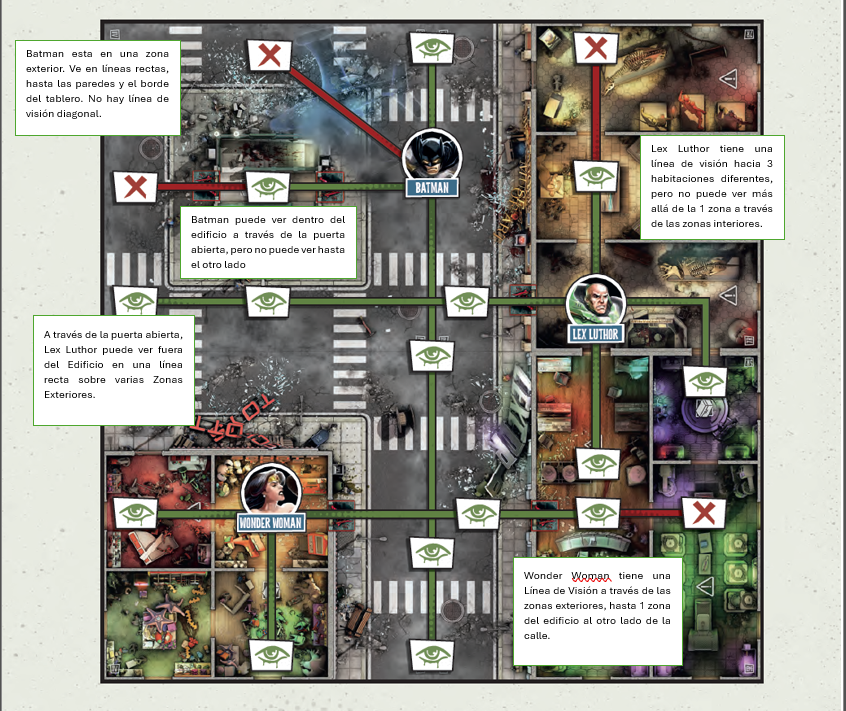
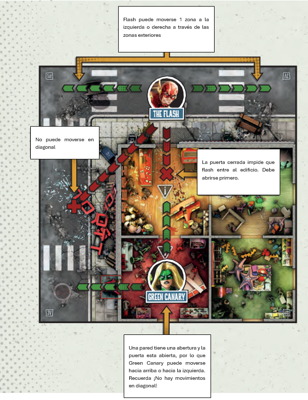
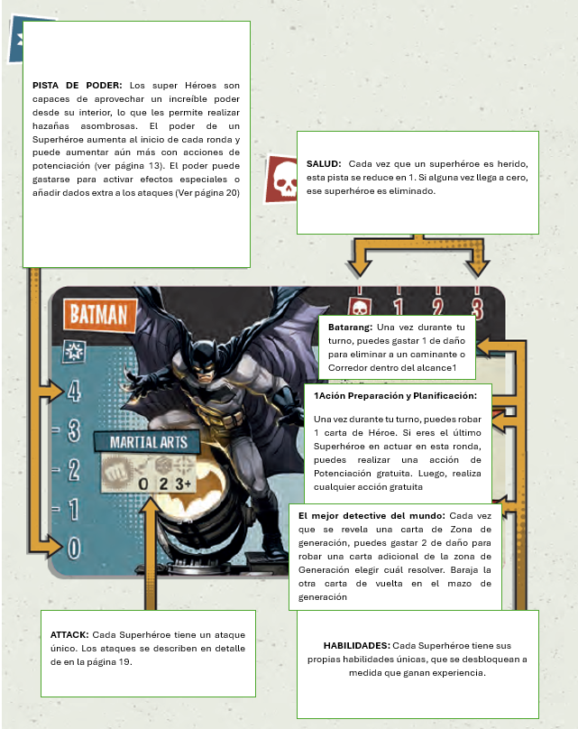
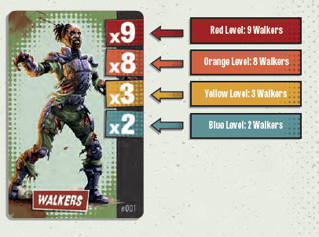

# Básicos

## <mark style="background-color:red;">LOS BÁSICOS</mark>

Antes de entrar en detalles, aquí hay algunas reglas generales que ayudarán a los jugadores:

<table data-header-hidden><thead><tr><th width="278"></th><th></th></tr></thead><tbody><tr><td><strong>Definición</strong></td><td><strong>Descripción</strong></td></tr><tr><td><strong>Héroe</strong></td><td>Un personaje vivo y superpoderoso controlado por un jugador.</td></tr><tr><td><strong>Héroe Zombi</strong></td><td>Un personaje superpoderoso zombi generado y controlado por el juego para luchar contra los jugadores.</td></tr><tr><td><strong>Horda Zombie</strong></td><td>Un zombi genérico Caminante, Bruto o Corredor generado y controlado por el juego para cazar a los jugadores. Ten en cuenta que las expansiones pueden incluir tipos adicionales de Horda.</td></tr><tr><td><strong>Enemigo</strong></td><td>Este término se refiere a todas las diversas Hordas y Héroes Zombi.</td></tr><tr><td><strong>Zona</strong></td><td>En ubicaciones exteriores, una Zona es el área entre las marcas lineales (o las marcas lineales y el borde del tablero) y las paredes de los edificios. En ubicaciones interiores, cada Habitación es una Zona separada (delimitada por paredes).</td></tr></tbody></table>

<figure><figcaption></figcaption></figure>

## <mark style="background-color:blue;">LINE OF SIGHT</mark>

La Línea de Visión define si dos miniaturas en el tablero (Superhéroes, Enemigos, Civiles, etc.) pueden verse entre sí.

#### Información Adicional

* **En Zonas Exteriores**, la Línea de Visión se traza en líneas rectas que corren paralelas a los bordes del tablero. No se puede trazar diagonalmente. Los elementos tienen Línea de Visión a través de tantas Zonas como la línea pueda pasar antes de llegar a una pared o al borde del tablero.
* **En Zonas Interiores**, la Línea de Visión puede trazarse hacia cualquier Habitación que comparta una apertura con la Zona en la que la miniatura se encuentra actualmente. Si hay una apertura, las paredes no bloquean la Línea de Visión entre 2 Habitaciones. Sin embargo, la Línea de Visión hacia una Habitación adyacente siempre está limitada a 1 Zona. La Línea de Visión trazada entre una Zona Interior y Zonas Exteriores puede trazarse a través de cualquier cantidad de Zonas Exteriores en línea recta, pero solo 1 Zona dentro del Edificio
* .**Las puertas cerradas** bloquean la Línea de Visión.
* **Los Enemigos, Civiles y Superhéroes** no bloquean la Línea de Visión.

<figure><figcaption></figcaption></figure>

## <mark style="background-color:blue;">MOVIMIENTO</mark>

<table data-header-hidden><thead><tr><th width="331"></th><th></th></tr></thead><tbody><tr><td><strong>Concepto</strong></td><td><strong>Descripción</strong></td></tr><tr><td><strong>Movimiento</strong></td><td>Las miniaturas, como los superhéroes, enemigos y civiles, pueden moverse de su Zona a una adyacente. Una Zona adyacente comparte al menos un borde sin obstrucciones con su Zona actual. ¡Las esquinas no cuentan! Esto significa que no hay movimientos diagonales.</td></tr><tr><td><strong>Movimiento en Zonas Exteriores</strong></td><td>En las Zonas Exteriores, el movimiento de una Zona vacía a otra no tiene restricciones. Sin embargo, las piezas del juego deben pasar por una puerta abierta para moverse de una Zona Exterior a una Zona Interior y viceversa.</td></tr><tr><td><strong>Movimiento en Zonas Interiores</strong></td><td>En las Zonas Interiores, las miniaturas pueden moverse de una Habitación a otra siempre que sus Zonas estén conectadas por una apertura (como una puerta abierta). La posición de la miniatura en la Zona y la disposición de las paredes no importan, siempre que las Zonas compartan una apertura.</td></tr><tr><td><strong>Restricciones de Movimiento para Superhéroes</strong></td><td>El movimiento de los superhéroes se ve obstaculizado por enemigos en su Zona (ver página 13).</td></tr></tbody></table>

<figure><figcaption></figcaption></figure>

## <mark style="background-color:blue;">TARJETA DE IDENTIFIACIÓN</mark>

**Cada superhéroe tiene una tarjeta de identificación única que incluye la siguiente información:**

<figure><figcaption></figcaption></figure>

## <mark style="background-color:blue;">EXPERIENCIA, NIVEL DE PELIGRO Y HABILIDADES</mark>

Cada vez que un superhéroe elimina a un enemigo, gana 1 Punto de Experiencia (XP). En el caso de los Héroes Zombi enemigos, obtendrán 1 Punto de Experiencia por cada punto de Resistencia que tenían (consulta Héroes Zombi en la página XX). Siempre que se gane experiencia, avanza la Barra de Peligro de ese superhéroe por esa cantidad. Algunas misiones también pueden proporcionar formas adicionales de ganar experiencia.

Hay 4 Niveles de Peligro en la Barra de Peligro: Azul, Amarillo, Naranja y Rojo. Al alcanzar un nuevo Nivel de Peligro, el superhéroe desbloquea una nueva habilidad que lo ayudará en su misión.

<figure><figcaption></figcaption></figure>

¡Ganar experiencia tiene un efecto secundario! Cuando los jugadores saquen una carta de Generación, deben leer la línea que corresponde al Nivel de Peligro más alto alcanzado por CUALQUIER superhéroe (consulta Generar Enemigos en la página 17). Cuanto más poderosos se vuelvan los superhéroes, más grande será la horda de zombis atraída para esparcir la Anti-Vida.

<figure><figcaption></figcaption></figure>

