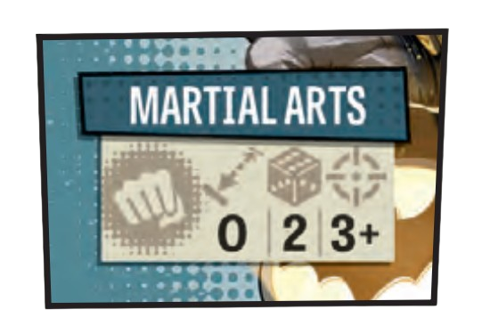

# Combate

### Acciones de Ataque

Cuando un Superhéroe lleva a cabo una Acción de Ataque, puede optar por utilizar su Ataque único, el cual se describe en su carta de Identificación, o bien hacer uso del Ataque de cualquier carta de Equipo que haya obtenido. Cada Ataque contiene los siguientes elementos esenciales:

#### Tipo de Ataque

Los Ataques se clasifican en dos categorías: **Cuerpo a Cuerpo** y **A Distancia**. Cada categoría se identifica con un símbolo distintivo, y algunas Habilidades o efectos pueden interactuar de manera particular con estos tipos:

* **Cuerpo a Cuerpo**: Estos ataques se identifican por su símbolo específico y solo pueden llevarse a cabo contra enemigos que se encuentren en la misma Zona que el Superhéroe.
* **A Distancia**: Se representan con el símbolo de Ataque a Distancia y permiten atacar a Enemigos situados en diferentes Zonas, siempre que estén dentro de la Línea de Visión del atacante.

<figure><figcaption></figcaption></figure>

### Alcance

El Alcance determina la distancia que un Ataque puede abarcar:

* **Cuerpo a Cuerpo**: Los ataques con un Alcance de 0 solo pueden dirigirse a objetivos ubicados en la misma Zona que el atacante.
* **A Distancia**: Estos ataques especifican un Alcance mínimo (la distancia más cercana a la que se puede atacar) y un Alcance máximo (la distancia más lejana). Por ejemplo, un Alcance mínimo de 0 permite atacar a Enemigos en la misma Zona, mientras que el Alcance máximo establece límites sobre las Zonas más alejadas que pueden ser atacadas.

### Dados

Cada Ataque especifica la cantidad base de dados que se deben lanzar. Este número puede aumentarse mediante la adición de dados extra a través de efectos del juego, como gastar Poder o aplicar otros modificadores.

<figure><figcaption></figcaption></figure>

### Precisión

La Precisión indica el valor que los dados deben alcanzar para ser contabilizados como un Impacto. Si el resultado de un dado es igual o superior al valor de Precisión del Ataque, ese dado se considera exitoso.

### Resolución de un Ataque

Para realizar un Ataque, sigue los pasos a continuación:

#### Prioridad de Objetivos

Al realizar un ataque, ya sea un Ataque Cuerpo a Cuerpo o a Distancia, los Impactos deben asignarse a los Enemigos siguiendo este orden de prioridad:

1. Héroe Zombi
2. Bruto
3. Caminante
4. Corredor

<figure><figcaption></figcaption></figure>

Los Impactos se asignan a los objetivos dentro de la categoría con mayor prioridad hasta que estos sean eliminados, antes de proceder a la siguiente categoría. Si hay múltiples Enemigos en la misma categoría de prioridad, los jugadores deben llegar a un acuerdo sobre a qué objetivos se destinarán los Impactos.

### Eliminación de Enemigos

Los enemigos son considerados eliminados cuando reciben un número de Impactos que coincide con su valor de Resistencia. Recuerda que los Caminantes y Corredores poseen una Resistencia de 1, los Brutos tienen una Resistencia de 2, y los Héroes Zombis presentan su Resistencia especificada en su carta.

Un enemigo solo se elimina si recibe suficientes Impactos que igualen su Resistencia durante una única Acción de Ataque. Si no se logran obtener suficientes Impactos para eliminarlos, los Impactos asignados no se acumulan. ¡Cada ataque es todo o nada!

#### Ejemplo

Cyborg efectúa Ataques a Distancia con su Blaster (Dados: 3, Precisión: 4+). En la Zona objetivo hay 2 Brutos, 1 Corredor y 1 Testigo.

* Para su primera Acción, Cyborg lanza 6, 5 y 4, logrando 3 Impactos. Según el orden de Prioridad de Objetivos, se necesitan 2 Impactos para eliminar a 1 Bruto, y el tercer Impacto simplemente rebota en el segundo Bruto.
* En su segunda Acción, lanza 5, 4 y 3, obteniendo 2 Impactos. El Bruto que queda aún requiere 2 Impactos para ser eliminado, por lo que el Corredor queda ileso.
* En su tercera Acción, lanza 6, 4 y 2, consiguiendo 2 Impactos. Con 1 Impacto es suficiente para eliminar al Corredor. El último Impacto no afecta al Testigo, ya que no es afectado por los Ataques de Superhéroes.

<figure><figcaption></figcaption></figure>

#### Pasos para Atacar

* **Seleccionar un Objetivo**: Elige una Zona dentro del Alcance establecido por el Ataque. Es fundamental que mantengas Línea de Visión para poder realizar el ataque. Ten en cuenta que los Ataques a Distancia pueden dirigirse a otras Zonas, incluso si hay Enemigos en tu Zona actual.
  * En el caso de las Zonas Interiores, la Línea de Visión está limitada a aquellas que comparten una abertura o que se encuentran en la misma habitación.
  * En Zonas Exteriores, la Línea de Visión se extiende en línea recta hasta encontrar una pared o el borde del tablero.
* **Realizar el Lanzamiento de Dados**: Tira la cantidad de dados especificada por el Ataque, y no olvides incluir cualquier dado adicional que puedas obtener por efectos de Rasgos Heroicos, Testigos, Habilidades o Poder gastado.
* **Distribuir Impactos**: Los Impactos logrados deben asignarse a los Enemigos en la Zona objetivo, siguiendo siempre el orden de Prioridad de Objetivos establecido.

### Relanzamientos

Los dados se pueden relanzar una vez debido a efectos de Superhéroes y una vez por efectos de Enemigos. Si ambos, el Superhéroe y el Enemigo, tienen influencia sobre los mismos dados, se realizará primero el relanzamiento correspondiente al Enemigo, seguido del relanzamiento del Superhéroe.
