# Componentes del juego

## COMPONENTES DE ZOMBICIDE DCEASED

<figure><figcaption>
Zombiecide DCeased
</figcaption></figure>

***

## 85 Miniaturas

***

### 8 Super Heroes (Super Héroes)



<figure><figcaption>
Green Arrow
</figcaption></figure>



<figure>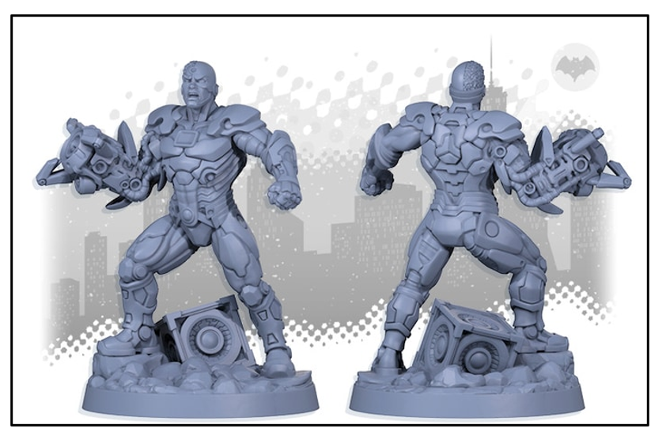<figcaption>
Cyborg
</figcaption></figure>



<figure>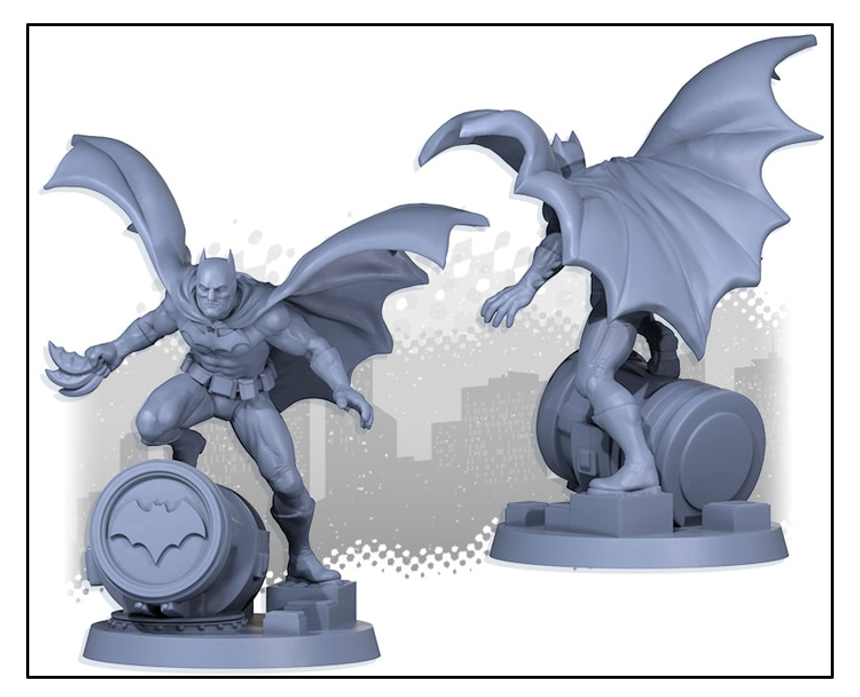<figcaption>
Batman
</figcaption></figure>



<figure><figcaption>
Green Canary
</figcaption></figure>





<figure>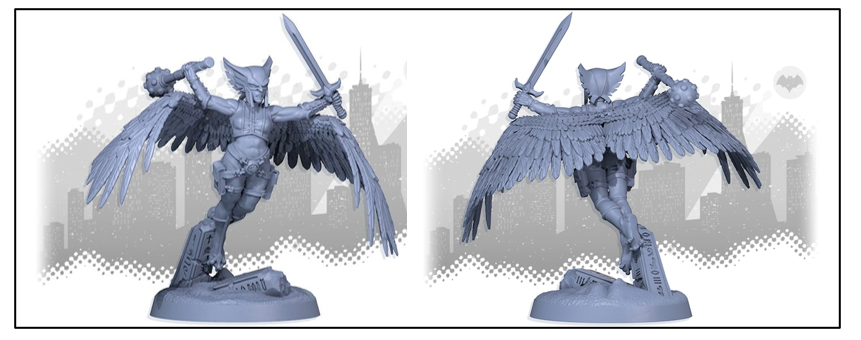<figcaption>
Hawkgirl
</figcaption></figure>



<figure><figcaption>
Lex Luthor
</figcaption></figure>



<figure><figcaption>
The Flash
</figcaption></figure>



<figure><figcaption>
Wonder Woman
</figcaption></figure>



***

### 6 Zombie Heroes (Héroes zombis)



<figure>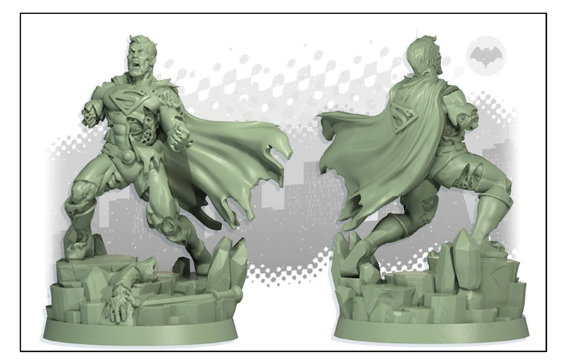<figcaption>
Superman
</figcaption></figure>



<figure>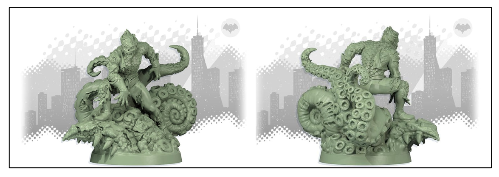<figcaption>
Aquaman
</figcaption></figure>



<figure><figcaption>
Green Lantern
</figcaption></figure>





<figure>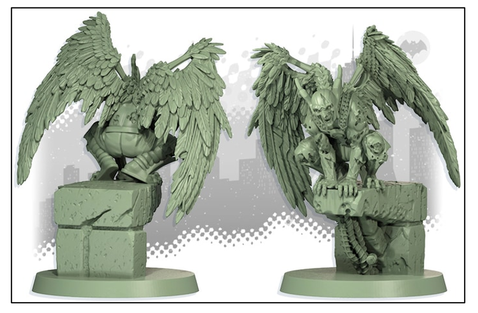<figcaption>
Hawkman
</figcaption></figure>



<figure><figcaption>
Martian Manhunter
</figcaption></figure>



<figure>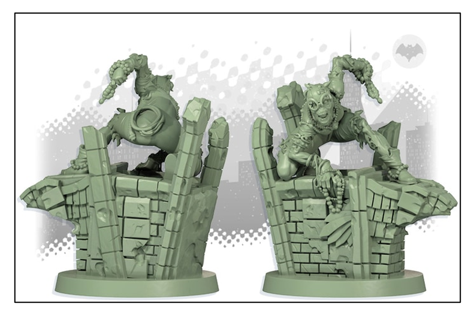<figcaption>
Catwoman
</figcaption></figure>



***

### 8 Bystanders (espectadores)



<figure><figcaption>
Bibbo Bibbowski
</figcaption></figure>



<figure><figcaption>
Lois Lane
</figcaption></figure>



<figure><figcaption>
Dan Turpin
</figcaption></figure>



<figure><figcaption>
Mercy Graves
</figcaption></figure>





<figure><figcaption>
Jimmy Olsen
</figcaption></figure>



<figure><figcaption>
Perry White
</figcaption></figure>



<figure><figcaption>
Lana Lang
</figcaption></figure>



<figure><figcaption>
Martha Kent
</figcaption></figure>



***

### 63 Zombies (Zombies)

***

#### _35 Walkers_



<figure>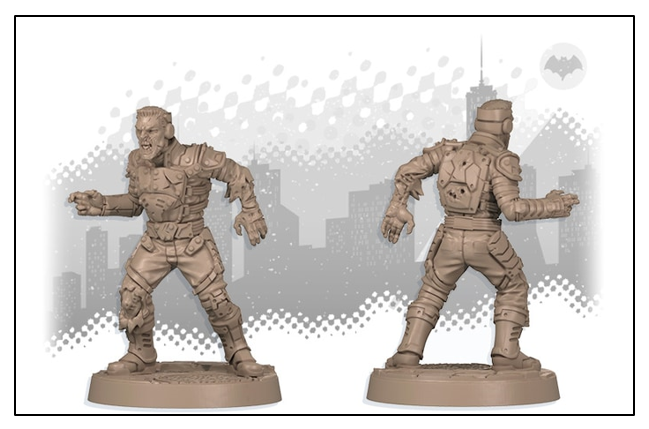<figcaption>
1 x 7
</figcaption></figure>



<figure>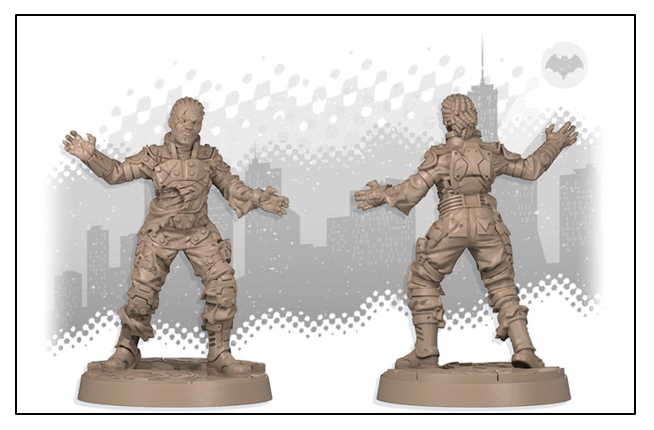<figcaption>
1 x 7
</figcaption></figure>



<figure>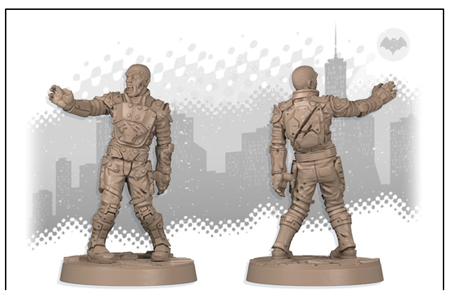<figcaption>
1 x 7
</figcaption></figure>



<figure>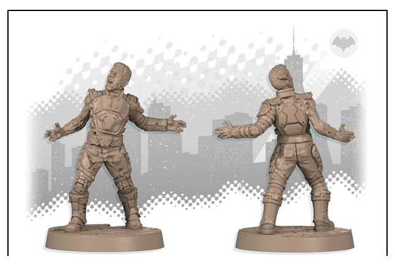<figcaption>
1 x 7
</figcaption></figure>



<figure>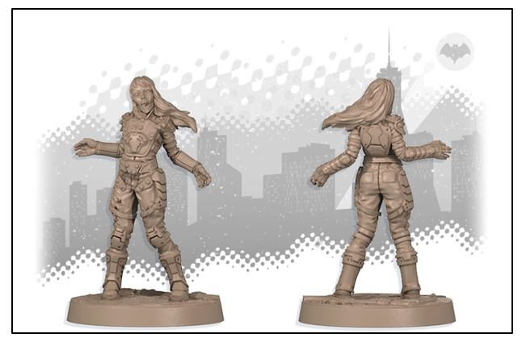<figcaption>
1 x 7
</figcaption></figure>



***

#### _14 Runners_



<figure>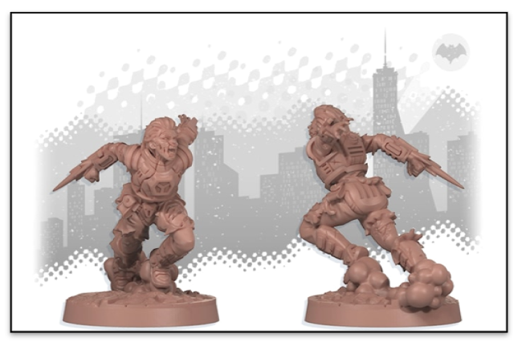<figcaption>
1x7
</figcaption></figure>



<figure>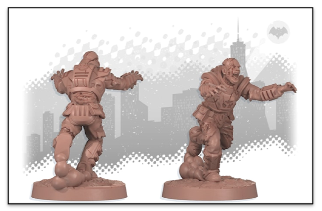<figcaption>
1 x 7
</figcaption></figure>



***

#### _14 **Brutes**_



<figure>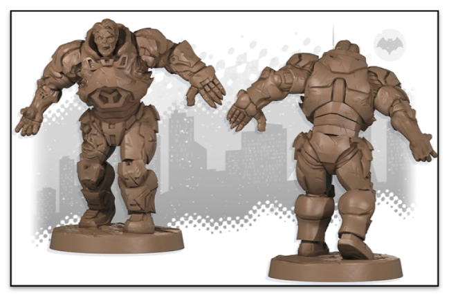<figcaption>
1x7
</figcaption></figure>



<figure><figcaption>
1 x 7
</figcaption></figure>



***

## 60 TOKENS

<table data-card-size="large" data-view="cards"><thead><tr><th align="center">Token</th><th align="center">Cantidad</th><th data-hidden data-card-cover data-type="files"></th></tr></thead><tbody><tr><td align="center"><strong>Interactive Object Reference Cards</strong> (Objectos Interactivos)</td><td align="center">3</td><td><a href="../.gitbook/assets/interactiveobject.png">interactiveobject.png</a></td></tr><tr><td align="center"><strong>Door Tokens</strong> (open/closed) (Tokens de Puerta abierta/cerrada)</td><td align="center">29</td><td><a href="../.gitbook/assets/doortoken.png">doortoken.png</a></td></tr><tr><td align="center"><strong>Objective Token</strong> (Token de Objetivo)</td><td align="center">10</td><td><a href="../.gitbook/assets/objectivetoken.png">objectivetoken.png</a></td></tr><tr><td align="center"><strong>Spawn Point Tokens</strong> (Tokens del Punto de Aparición)</td><td align="center">10</td><td><a href="../.gitbook/assets/spawnpoints.png">spawnpoints.png</a></td></tr><tr><td align="center"><strong>Exit Token</strong> (Token de Salida)</td><td align="center">1</td><td><a href="../.gitbook/assets/exittoken.png">exittoken.png</a></td></tr><tr><td align="center"><strong>Activation Tokens</strong> (Tokens de Activación)</td><td align="center">6</td><td><a href="../.gitbook/assets/activationtokens.png">activationtokens.png</a></td></tr></tbody></table>

***

## 130 CARTAS

<table data-card-size="large" data-view="cards"><thead><tr><th align="center">Carta</th><th align="center">Cantidad</th><th data-hidden data-card-cover data-type="files"></th></tr></thead><tbody><tr><td align="center"><strong>SUPER HERO ID CARDS</strong> (Cartas de Superhéroes)</td><td align="center">8</td><td><a href="../.gitbook/assets/cartas-superheroes.png">cartas-superheroes.png</a></td></tr><tr><td align="center"><strong>HEROIC TRAIT CARDS (</strong>Tarjetas De Rasgos Heroicos<strong>)</strong></td><td align="center">45</td><td><a href="../.gitbook/assets/cartas-heroictraits.png">cartas-heroictraits.png</a></td></tr><tr><td align="center"><strong>SPAWN CARDS (</strong>Tarjetas De Aparición<strong>)</strong></td><td align="center">45</td><td><a href="../.gitbook/assets/cartas-horde.png">cartas-horde.png</a></td></tr><tr><td align="center"><strong>BYSTANDER CARDS (</strong>Tarjetas De Espectador<strong>)</strong></td><td align="center">11</td><td><a href="../.gitbook/assets/cartas-bystanders.png">cartas-bystanders.png</a></td></tr><tr><td align="center"><strong>ZOMBIE HERO CARDS (Cartas Zombie)</strong></td><td align="center">6</td><td><a href="../.gitbook/assets/cartas-zombieheroes.png">cartas-zombieheroes.png</a></td></tr><tr><td align="center"><strong>EQUIPMENT CARDS (</strong>Tarjetas De Equipo<strong>)</strong></td><td align="center">12</td><td><a href="../.gitbook/assets/cartas-equipamiento.png">cartas-equipamiento.png</a></td></tr></tbody></table>

***

## 9 DOUBLE-SIDED TILES (9 Azulejos De Doble Cara)

<figure>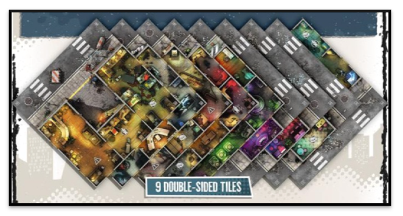<figcaption></figcaption></figure>
