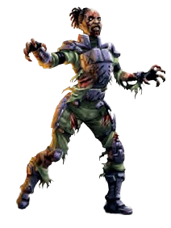
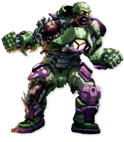
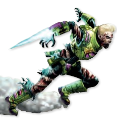
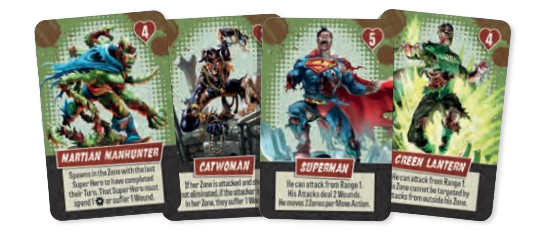

# Enemigos

| Existen 4 tipos de Enemigos. La mayoría de los Enemigos tienen una sola Acción que realizan cuando se activan. Las excepciones a esto son los Corredores y los Héroes Zombi, que tienen 2 Acciones por Activación. Un Enemigo es eliminado tan pronto como recibe suficientes Golpes durante una única Acción de Ataque que igualen su valor de Resistencia. _**El Superhéroe que elimine al Enemigo gana 1 Punto de Experiencia, excepto en el caso de los Héroes Zombi, que otorgan Experiencia igual a su valor de Resistencia.**_ |  |
| ------------------------------------------------------------------------------------------------------------------------------------------------------------------------------------------------------------------------------------------------------------------------------------------------------------------------------------------------------------------------------------------------------------------------------------------------------------------------------------------------------------------------------------- | ------------------------------------------------ |

| 
<strong>CAMINANTE</strong> 
 | 
Aunque los Soldados de LexCorp pueden ser lentos y débiles, el verdadero peligro de los Caminantes reside en su número. 
<table data-header-hidden><thead><tr><th></th><th></th></tr></thead><tbody><tr><td></td><td><ul><li><strong>Acciones</strong>: 1</li><li><strong>Resistencia</strong>: 1</li><li><strong>Recompensa de XP</strong>: 1</li></ul></td></tr></tbody></table>                       |
| ------------------------------------------------------------------------------------------------------------- | ------------------------------------------------------------------------------------------------------------------------------------------------------------------------------------------------------------------------------------------------------------------------------------------------------------------------------------------------------------------------------------------------------------------------------------------------------------------------------------------ |
| 
<strong>BRUTO</strong> 
                              | 
Los Soldados Pesados de LexCorp son fuertes y resistentes. Estos Brutos son difíciles de derribar. 
<table data-header-hidden><thead><tr><th></th><th></th></tr></thead><tbody><tr><td></td><td><ul><li><strong>Acciones</strong>: 1</li><li><strong>Resistencia</strong>: 2</li><li><strong>Recompensa de XP</strong>: 1</li></ul></td></tr></tbody></table>                                                |
| 
<strong>CORREDOR</strong>  
                    | 
Los Soldados de Choque de LexCorp son rápidos y mortales. Estos Corredores son una verdadera amenaza que debe ser priorizada. 
<table data-header-hidden><thead><tr><th></th><th></th></tr></thead><tbody><tr><td></td><td><ul><li><strong>Acciones</strong>: 1</li><li><strong>Resistencia</strong>: 1</li><li><strong>Recompensa</strong> <strong>de XP</strong>: 1</li></ul></td></tr></tbody></table> |

<mark style="background-color:blue;">**HÉROES ZOMBIE**</mark>

Cada Héroe Zombi es poderoso y único, pero han sido dominados por el Virus Anti-Vida, lo que los impulsa a destruir tanta vida como puedan.

<figure><figcaption></figcaption></figure>

• **Acciones**: 2

• **Resistencia**: Esto es específico para cada Héroe Zombi, como se indica en su carta de Héroe Zombi.

• **Recompensa de XP**: Igual a su Resistencia.

• _Cada Héroe Zombi también tiene una Habilidad única que aparece en su carta de Héroe Zombi, la cual está activa mientras estén en el tablero._
