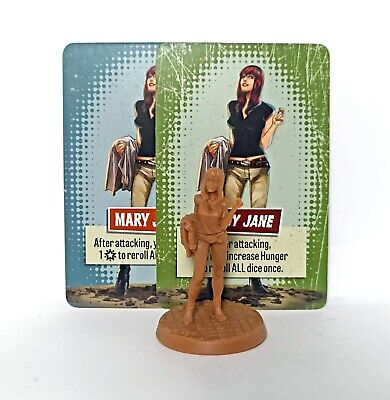

# Espectadores

Los Testigos representan personajes clave que los Superhéroes deben intentar rescatar de los zombis. Consulta la página 14 para conocer las reglas completas sobre cómo Rescatar a un Testigo. Una vez rescatado, un Testigo se convierte en un Testigo Escoltado. Antes de ser rescatados, los Testigos tienen varias reglas especiales que se detallan a continuación.

**TESTIGOS EN PELIGRO**\
Cuando los Enemigos se activan, tratan a los Testigos como posibles objetivos, al igual que a los Superhéroes. Si un Testigo es su objetivo más cercano, se moverán hacia él. Si un Testigo está en su Zona, lo atacarán. Si diferentes Testigos o Superhéroes son objetivos igualmente elegibles, los jugadores deciden a quién atacará el Enemigo.

* Los Testigos son eliminados al sufrir 1 Herida. Esto desencadena el evento "Testigo Eliminado".
* Los Testigos no pueden ser dañados por los Superhéroes. Simplemente son ignorados por los Ataques de los Superhéroes.

<figure><figcaption></figcaption></figure>

**¡TESTIGO ELIMINADO!**\
Si un Testigo es eliminado, se retira del tablero y su carta se descarta. Esto es un duro golpe para todos los Superhéroes, ya que han fallado en su propósito principal de proteger a los inocentes. Cada Testigo que sea eliminado desencadena de inmediato ambos efectos:

* **Todos** los Superhéroes pierden 1.
* **Todos** los Superhéroes deben descartar 1 Rasgo Heroico.

**ACTIVACIÓN DE LOS TESTIGOS**\
Durante la Fase de Enemigos, los Testigos intentan huir de las hordas de zombis y alcanzar a los Superhéroes para ser rescatados. Al final del paso de Activación de Enemigos, pero antes del paso de Generación de Enemigos, cualquier Testigo en el tablero se activa. Se mueven 1 Zona hacia la Zona más cercana con un Superhéroe.

* Si un Testigo tiene más de una Zona cercana con Superhéroes o más de una ruta de la misma longitud a la Zona más cercana, los jugadores deciden por dónde se mueve el Testigo.
* Si hay Enemigos en su Zona o en la Zona adyacente a la que se movería, el Testigo no se mueve.

<figure><figcaption></figcaption></figure>

**TESTIGOS ESCOLTADOS**\
Una vez que un Testigo es rescatado por un Superhéroe, se convierte en un Testigo Escoltado, otorgando varios beneficios al Superhéroe:

* Coloca la carta del Testigo junto al tablero del Superhéroe. Mientras escolta a un Testigo, ese Superhéroe puede utilizar el efecto del Testigo, normalmente gastando una cantidad indicada de .
* Mantén la miniatura del Testigo Escoltado junto al Superhéroe que tiene su carta. Siempre se mueve con ese Superhéroe, sin importar las habilidades o efectos relacionados con el movimiento.
* Un Superhéroe puede escoltar cualquier número de Testigos en cualquier momento.
* Cualquier momento en que un Superhéroe fuera a recibir Heridas, puede descartar uno de sus Testigos Escoltados para prevenir 1 Herida. Esto no debe hacerse a la ligera, ya que desencadena el evento "Testigo Eliminado".
* Los Testigos Escoltados pueden ser intercambiados entre Superhéroes cuando se realiza la Acción de Intercambio.
* Una vez que se convierten en Escoltados, los Testigos no pueden ser alejados de su Superhéroe asignado por ningún motivo.
* Si un Superhéroe que está escoltando Testigos es eliminado, esos Testigos vuelven a ser Testigos no rescatados y siguen todas las reglas asociadas
