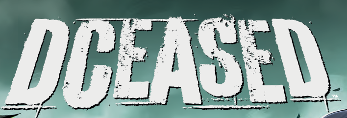
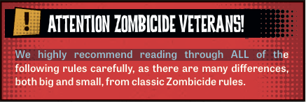
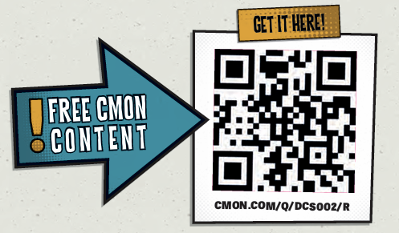

# Introducción

<figure><figcaption></figcaption></figure>

La interferencia de **Darkseid** con la **Ecuación Anti-Vida** liberó un virus tecno-orgánico que se propagó rápidamente por las redes digitales del mundo.

***

### **Propagación del Virus**

* Aquellos desafortunados que vieron la ecuación en sus pantallas intentaron arrancársela de la cabeza.
* La infección inevitablemente los transformó en los **Anti-Vivientes**.

***

### **Los Anti-Vivientes**

* Estos zombis salvajes existen con un solo propósito:
  * Propagar la **Anti-Vida** matando o infectando a cualquier ser vivo que encuentren.

***

### **Impacto en los Superhéroes**

* Ni siquiera los superhéroes más poderosos del universo están a salvo del virus.
* La **Liga de la Justicia** ha sido destrozada (literalmente).
* Antiguos enemigos unen fuerzas.
* Viejos aliados deben ser eliminados antes de que puedan causar aún más destrucción.

***

### **Llamado a la Acción**

* Reúne a tu equipo de superhéroes.
* Acumula todo el poder que puedas.
* Enfrenta a los **DCeased**.

***

### **DCeased – A Zombicide Game**

#### **Descripción del juego:**

* Es un juego cooperativo.
* De 1 a 6 jugadores controlan a los últimos superhéroes no infectados.
* Se enfrentan a héroes zombis y a las hordas de zombis controladas por el propio juego.

***

#### **Objetivos y Mecánicas del Juego:**

| **Objetivos del Juego** | **Mecánicas del Juego**                                                         |
| ----------------------- | ------------------------------------------------------------------------------- |
| Completar las Misiones  | Eliminar zombis te da experiencia para volverte más poderoso                    |
| Derrotar a los Enemigos | Cuanto más fuerte seas, más zombis aparecerán para cazarte                      |
| Rescatar a los Civiles  | Solo trabajando juntos, los superhéroes podrán poner fin a la amenaza Anti-Vida |

***

<figure><figcaption></figcaption></figure>

**Objetivos del Juego:**

* Completar las misiones.
* Derrotar a los enemigos.
* Rescatar a los civiles.

***

**Mecánicas del Juego:**

* Eliminar zombis te da la experiencia necesaria para convertirte en un superhéroe aún más poderoso.
* ¡Pero cuanto más fuerte seas, más zombis aparecerán para cazarte!
* Solo trabajando juntos y llevando sus poderes al límite, los superhéroes podrán tener la esperanza de poner fin a la amenaza de la **Anti-Vida**.

<figure><figcaption></figcaption></figure>

***

