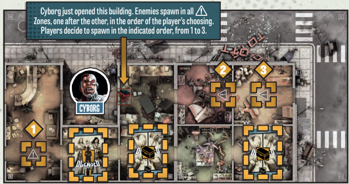

# Turno Enemigos

|                                                                                                                                                                                                                                                                                                                                                                                                                                                                                                                                                                                                                                                                                                                                                                                                                                      |                                                                                      |
| ------------------------------------------------------------------------------------------------------------------------------------------------------------------------------------------------------------------------------------------------------------------------------------------------------------------------------------------------------------------------------------------------------------------------------------------------------------------------------------------------------------------------------------------------------------------------------------------------------------------------------------------------------------------------------------------------------------------------------------------------------------------------------------------------------------------------------------ | ------------------------------------------------------------------------------------ |
| 
Una vez que todos los jugadores hayan activado a sus Superhéroes, la Fase de Jugador termina y comienza la Fase de Enemigos. Ningún jugador controla a los Enemigos. Ellos actúan por sí mismos, realizando los siguientes pasos en orden:  1. <strong>Activar Enemigos</strong>: Todos los Enemigos en el tablero se activan y gastan sus Acciones para atacar a un Superhéroe o un Civil en su Zona, o moverse hacia el Superhéroe o Civil más cercano si no están en una Zona con uno. Una vez que todos los Enemigos se han activado, los Civiles en el tablero también se activan (ver Activación de Civiles en la página 21).  2. <strong>Generar Enemigos</strong>: Después de que todas las Activaciones han terminado, nuevos Enemigos aparecen en todos los Puntos de Generación activos en el tablero.
 |  |
|                                                                                                                                                                                                                                                                                                                                                                                                                                                                                                                                                                                                                                                                                                                                                                                                                                      |                                                                                      |

***

| **Activar Enemigos**                                                                                                                                                                                                                                                                                                                                                                                                                                                                                                                                                                                                                                                                                                                                                                                                                                                                                                     | **Ataques a Civiles**                                                                                                                                                                                                                                                                                                                                                                                                                                                                                                                                                                                                                                                                                                                                                                                                                                                                                                                                                                                                                                                                                                                |
| ------------------------------------------------------------------------------------------------------------------------------------------------------------------------------------------------------------------------------------------------------------------------------------------------------------------------------------------------------------------------------------------------------------------------------------------------------------------------------------------------------------------------------------------------------------------------------------------------------------------------------------------------------------------------------------------------------------------------------------------------------------------------------------------------------------------------------------------------------------------------------------------------------------------------ | ------------------------------------------------------------------------------------------------------------------------------------------------------------------------------------------------------------------------------------------------------------------------------------------------------------------------------------------------------------------------------------------------------------------------------------------------------------------------------------------------------------------------------------------------------------------------------------------------------------------------------------------------------------------------------------------------------------------------------------------------------------------------------------------------------------------------------------------------------------------------------------------------------------------------------------------------------------------------------------------------------------------------------------------------------------------------------------------------------------------------------------ |
| 
<strong>ATAQUE</strong>: Cada Enemigo en la misma Zona que un Superhéroe o un Civil gasta su Acción para realizar un Ataque. El Ataque de un Enemigo siempre tiene éxito, no requiere ninguna tirada de dados, e inflige 1 Herida.  Los Superhéroes en la Zona comparten las Heridas de la manera que los jugadores prefieran, ¡incluso si eso significa infligirlas todas a un solo Superhéroe! Cualquier Civil en la misma Zona que los Superhéroes solo puede recibir una única Herida.  Cuando un Superhéroe es herido, el marcador de su Barra de Salud se mueve 1 espacio hacia la izquierda por cada Herida que reciba. Un Superhéroe es eliminado tan pronto como su Barra de Salud llega a 0. Si todos los Superhéroes son eliminados antes de completar los Objetivos de la Misión, ¡el juego se pierde!

 | 
<strong>Los Civiles</strong> son eliminados si reciben 1 Herida. Esto representa un gran fracaso para los Superhéroes, activando los efectos de Civil Eliminado (ver página 21).  Un Superhéroe con cualquier Civil Escoltado (ver página 21) puede optar por descartarlos (¡el Civil se interpone en el camino!) para ignorar 1 Herida que recibiría por cada Civil Escoltado sacrificado de esta manera. Este es un acto desesperado, que también activa los efectos de Civil Eliminado.  Los Enemigos luchan juntos. Todos los Enemigos activados en la misma Zona que un Superhéroe o un Civil se unen al Ataque, incluso si se infligen tantas Heridas que sería un exceso.  <strong>Ejemplo 1</strong>: Un Caminante en una Zona con 2 Superhéroes inflige 1 Herida durante su Activación. Los jugadores eligen qué Superhéroe recibe la Herida.  <strong>Ejemplo 2</strong>: Un grupo de 5 Caminantes se activa en la misma Zona que 2 Superhéroes y 1 Civil. Como ambos Superhéroes tienen 3 de Salud, los jugadores eligen infligir 2 Heridas a cada Superhéroe y 1 al Civil (eliminándolo).
 |

| **Movimiento**                                                                                                                                                                                                                                                                                                                                                                                                                                                                                                                                                                      | **Reglas adicionales**                                                                                                                                                                                                                                                                                                                                                                                                                                                                                                                                                                                                                                                                                                                                                                                                                                                                          |
| ----------------------------------------------------------------------------------------------------------------------------------------------------------------------------------------------------------------------------------------------------------------------------------------------------------------------------------------------------------------------------------------------------------------------------------------------------------------------------------------------------------------------------------------------------------------------------------- | ----------------------------------------------------------------------------------------------------------------------------------------------------------------------------------------------------------------------------------------------------------------------------------------------------------------------------------------------------------------------------------------------------------------------------------------------------------------------------------------------------------------------------------------------------------------------------------------------------------------------------------------------------------------------------------------------------------------------------------------------------------------------------------------------------------------------------------------------------------------------------------------------- |
| 
<strong>MOVIMIENTO</strong>: Los Enemigos que no atacaron (porque no había Superhéroes o Civiles en su Zona) gastan su Acción para moverse 1 Zona hacia los Superhéroes o Civiles:  • Los Enemigos siempre se mueven hacia la Zona más cercana con Superhéroes o Civiles que esté en su Línea de Visión.  • Si el Enemigo no tiene Línea de Visión hacia ningún Superhéroe o Civil, se mueve hacia la Zona con Superhéroes o Civiles a la que tenga el camino abierto más corto. Si no hay caminos abiertos hacia Superhéroes o Civiles, el Enemigo no se mueve.
 | 
• Si hay más de una Zona cercana con Superhéroes o Civiles, o más de una ruta de la misma longitud hacia la Zona más cercana, los Enemigos se dividen en grupos de números iguales, separados por tipo, para seguir todas las rutas posibles. Si no es posible dividir a un tipo de Enemigo en grupos de número igual, los jugadores deciden qué grupo recibe el Enemigo extra.  • Los Enemigos no pueden abrir puertas.  <strong>Ejemplo</strong>: Un grupo de 4 Caminantes, 3 Brutos y 1 Héroe Zombi se activa a la misma distancia de 2 Zonas ocupadas por Superhéroes. Los Enemigos quieren atacar ambas Zonas, así que se dividen en 2 grupos:  • 2 Caminantes van por un camino. Los otros 2 toman la otra ruta. • 2 Brutos van por un camino. El último toma la otra ruta (los jugadores eligen). • Los jugadores eligen por cuál ruta va el Héroe Zombi.
 |

<figure><figcaption></figcaption></figure>

| **Corredores y Héroes Zombis**                                                                                                                                                                                                                                                                                                                                                                                                                                                                                                                                                                       | **Punto de generación normal**                                                                                                                                                                                                                                                                                                                          |
| ---------------------------------------------------------------------------------------------------------------------------------------------------------------------------------------------------------------------------------------------------------------------------------------------------------------------------------------------------------------------------------------------------------------------------------------------------------------------------------------------------------------------------------------------------------------------------------------------------- | ------------------------------------------------------------------------------------------------------------------------------------------------------------------------------------------------------------------------------------------------------------------------------------------------------------------------------------------------------- |
| 
<strong>CORREDORES Y HÉROES ZOMBIS</strong>: Los Corredores y Héroes Zombis tienen 2 Acciones por Activación. Cada vez que se activan, realizan 1 Acción, ya sea Atacando o Moviéndose con el resto de los Enemigos, y luego realizan su 2ª Acción, ya sea atacando si ahora están en una Zona con un Superhéroe o un Civil, o moviéndose nuevamente si todavía no están en una Zona con un Superhéroe o Civil.  <strong>2. GENERAR ENEMIGOS</strong>

El mapa de la Misión muestra dónde aparecen los Enemigos al final de cada Fase de Enemigos. Estos son Puntos de Generación.
 | .png>)                                                                                                                                                                                                                                                                                                                 |
|                                                                                                                                                                                                                                                                                                                                                                                                                                                                                                                              | _<mark style="color:blue;">**Ejemplo**</mark><mark style="color:blue;">: La Canario Verde tiene 5 XP, lo que la coloca en el Nivel de Peligro Azul. Cyborg tiene 12 XP, lo que lo coloca en Amarillo. Para determinar cuántos Enemigos se generan, lee la línea Amarilla, que corresponde a Cyborg, ya que tiene la mayor Experiencia.</mark>_          |
| <mark style="color:orange;">Los tokens de Punto de Generación marcan las Zonas de Generación en el tablero. Durante el paso de Generar Enemigos, siempre comienza desde el Primer Punto de Generación, marcado con un 1.</mark>                                                                                                                                                                                                                                                                                                                                                                      |                                                                                                                                                                                                                                                                                                                                                         |
| Comenzando con el primer token de Punto de Generación y avanzando en el sentido de las agujas del reloj, roba 1 carta de Generación, leyendo la línea que corresponde al Nivel de Peligro del Superhéroe con más Experiencia (Azul, Amarillo, Naranja o Rojo). Coloca la cantidad indicada del tipo de Enemigo correspondiente en esa Zona de Generación. Repite esto para cada token de Punto de Generación activo.                                                                                                                                                                                 | **Puntos de Generación de Colores:** Algunas Misiones cuentan con un token de Punto de Generación de color Azul y/o Verde. A menos que se indique lo contrario, estas Zonas no generan Enemigos hasta que ocurra un evento específico, dictado por la Misión. Estas Zonas solo comenzarán a generar Enemigos una vez que se cumplan estas condiciones.  |
| <mark style="color:orange;">**IMPORTANTE:**</mark> <mark style="color:orange;"></mark><mark style="color:orange;">Siempre genera Enemigos en función del Nivel de Peligro más alto alcanzado por cualquier Superhéroe, incluso si han sido eliminados. ¡La horda nunca se calma!</mark>                                                                                                                                                                                                                                                                                                              |                                                                                                                                                                                                                                                     |

Si la baraja de Generación se queda sin cartas, baraja todas las cartas de Generación descartadas para hacer una nueva baraja.&#x20;

La baraja de Generación presenta varios tipos de cartas de Generación:

| **¡CARGA!**: Cuando un jugador roba una carta de Carga de Enemigos, los Enemigos colocados por esa carta realizan inmediatamente una Activación después de ser colocados. |  |
| ------------------------------------------------------------------------------------------------------------------------------------------------------------------------- | -------------------------------------------------------------------- |

| 
<strong>¡ACTIVACIÓN EXTRA!</strong> 

Cuando un jugador roba una carta de Activación Extra, en lugar de generar nuevos Enemigos, todos los Enemigos del tipo listado se activan inmediatamente, realizando sus Acción(es) como de costumbre.
 |  |
| -------------------------------------------------------------------------------------------------------------------------------------------------------------------------------------------------------------------------------------------------------- | ------------------------------------------------------------------------ |

| 
<strong>ACCIÓN ESPECIAL</strong> 

Hay algunas cartas de Acción Especial en la Baraja de Generación. Cada una detalla sus instrucciones específicas cuando se roba.
 |  |
| ------------------------------------------------------------------------------------------------------------------------------------------------------------------------------- | ------------------------------------------------------------------------ |

| 
<strong>¡HÉROE ZOMBIE!</strong> 

Cuando un jugador roba una carta de Generación de Héroe Zombi, roba la carta superior de la baraja de Héroes Zombis, generando el Héroe Zombi indicado en esa Zona, junto con el número de Zombis de la Horda (Caminantes, Brutos o Corredores) que se indica en esa carta de Generación.
 |  |
| --------------------------------------------------------------------------------------------------------------------------------------------------------------------------------------------------------------------------------------------------------------------------------------------------------------------------------------- | ------------------------------------------------------------------------- |
