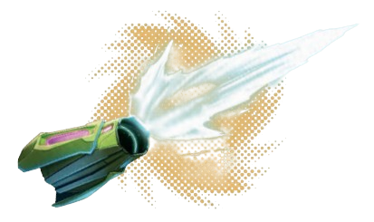
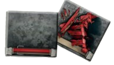
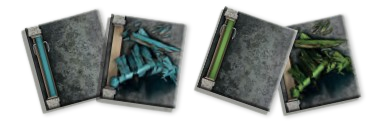
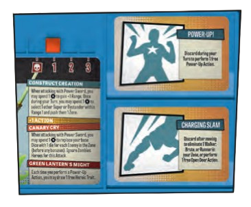
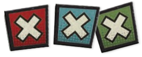
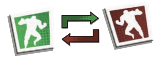

# Turno Jugador

Durante cada Fase de Jugador, se deben realizar los siguientes pasos, en orden:

1. **Ganar Poder**: Todos los jugadores aumentan en 1 su Pista de Poder.
2. **Actualizar los Tokens de Activación**: Todos los jugadores voltean sus tokens de Activación al lado verde (No Activado).
3. **Activar Superhéroes**: Se activan todos los Superhéroes, uno por uno. En cada Ronda, los jugadores eligen el orden en que se activará cada Superhéroe. Durante su Turno, un Superhéroe _puede realizar hasta 3 Acciones en el Nivel de Peligro Azul_ (sin contar ninguna Acción gratuita que le otorgue su Habilidad de Nivel Azul). Las Acciones disponibles para un Superhéroe son las siguientes:

<figure><figcaption></figcaption></figure>

<mark style="background-color:blue;">**MOVER**</mark>

\
El Superhéroe se desplaza desde su Zona a una Zona adyacente (no pueden moverse en diagonal, a través de paredes ni puertas cerradas).

\
• Un Superhéroe debe gastar 1 Acción adicional por cada Enemigo que esté de pie en la Zona de la que intenta salir.

\
<mark style="color:blue;">**Ejemplo**</mark><mark style="color:blue;">: Batman está en una Zona con 2 Caminantes. Para salir de esta Zona, gasta 1 Acción de Movimiento + 2 Acciones adicionales (1 por cada Caminante), para un total de 3 Acciones. Si hubiera habido 3 Enemigos en la Zona, Batman habría necesitado 4 Acciones (1+3) para moverse.</mark>

\
• Entrar en una Zona que contiene Enemigos finaliza la Acción de Movimiento del Superhéroe (esto es importante para Habilidades o efectos que permiten a los Superhéroes moverse por varias Zonas en una sola Acción de Movimiento).

| _<mark style="background-color:orange;">**EMPUJAR**</mark>_                                                                                                                                                                                                                                              |
| -------------------------------------------------------------------------------------------------------------------------------------------------------------------------------------------------------------------------------------------------------------------------------------------------------- |
| _Algunos efectos pueden indicar "empujar" una figura. Cuando una figura es empujada, se mueve el número de Zonas indicado por el efecto de Empuje, ignorando a los Enemigos. A menos que se especifique "hacia" o "lejos de" algo en el efecto, la figura puede moverse en cualquier dirección posible._ |

<mark style="background-color:blue;">**ABRIR PUERTA**</mark>

El Superhéroe abre una puerta en su Zona. Ten en cuenta que todas las Puertas que llevan a Edificios comienzan el juego Cerradas, a menos que se indique específicamente lo contrario en la Misión. Coloca un token de Puerta Abierta donde estaba la puerta cerrada para indicar que ahora está abierta (o, si ya había un token de Puerta Cerrada, simplemente dale la vuelta a su lado Abierto).\
Algunas Misiones incluyen puertas de colores. Normalmente, estas no pueden abrirse hasta que se cumpla alguna condición, como encontrar un Objetivo específico. Lee la descripción de la Misión para obtener más detalles.

&#x20;                                                      _<mark style="color:orange;">Tokens para puertas Cerradas y Abiertas</mark>_

<figure><figcaption></figcaption></figure>

| _<mark style="background-color:orange;">**NOTA**</mark>_ |
| -------------------------------------------------------- |
| _Una vez se abre una puerta, no se puede cerrar._        |

Algunas Misiones incluyen puertas de colores. Normalmente, estas no pueden abrirse hasta que se cumpla alguna condición, como encontrar un Objetivo específico. Lee la descripción de la Misión para obtener más detalles.

&#x20;                                                        _<mark style="color:orange;">Tokens para Puertas Azules y Verdes</mark>_

<figure><figcaption></figcaption></figure>

| _<mark style="background-color:orange;">**IMPORTANTE**</mark>_                                                                                                       |
| -------------------------------------------------------------------------------------------------------------------------------------------------------------------- |
| Abrir un Edificio por primera vez revela a todos los Enemigos y Civiles que esperan dentro. Esto se explica en la sección de Aparición en Edificios en la página XX. |

<mark style="background-color:blue;">**AUMENTO DE PODER**</mark>

Mientras los Superhéroes ganan automáticamente 1 de Poder al comienzo de cada Ronda, también pueden, durante su Turno, realizar una Acción de Aumento de Poder para incrementar su Pista de Poder en 2. Esto puede hacerse más de una vez por Turno.&#x20;

• Un Superhéroe solo puede tener un máximo de 4. Cualquier Poder adicional que se gane más allá de eso se ignora.&#x20;

• Muchas Habilidades y Rasgos requieren el gasto de Poder para utilizar diversos efectos, como se describe en sus textos.&#x20;

• El Poder también se utiliza generalmente para obtener Dados adicionales cuando un Superhéroe realiza un Ataque.

<mark style="background-color:blue;">**GANAR RASGO**</mark>

El jugador roba la carta superior del mazo de Rasgos Heroicos y la coloca en uno de los 2 espacios de Rasgos Heroicos en el Tablero de ese Superhéroe. _**Un Superhéroe solo puede realizar una única Acción de Ganar Rasgo por Turno**_, aunque otros efectos pueden otorgarles cartas adicionales de Rasgos Heroicos.&#x20;

• _**Cada Superhéroe puede tener un máximo de 2 Rasgos Heroicos en cualquier momento.**_ Si ya tiene 2 cuando roba uno nuevo, puede descartar el Rasgo recién robado o descartar y reemplazar uno de los 2 en su Tablero.&#x20;

• Si el mazo de Rasgos se queda sin cartas, baraja todas las cartas descartadas para formar un nuevo mazo.&#x20;

• Los Rasgos Heroicos tienen efectos poderosos, pero _**se descartan después de un único uso**_. Cada Rasgo Heroico tiene instrucciones específicas para sus efectos, ¡así que léelas cuidadosamente! Se pueden usar dos Rasgos juntos si se cumplen sus requisitos.&#x20;

• A menos que se indique lo contrario, _**usar**_ un Rasgo Heroico _**no cuesta una Acción**_. Se realiza de forma gratuita cuando se cumplen sus requisitos.

<figure><figcaption></figcaption></figure>

<mark style="background-color:blue;">**INTERACTUAR CON OBJETIVOS**</mark>

El Superhéroe toma y/o activa un Objetivo en su Zona. Los efectos específicos de hacerlo se detallan en la descripción de la Misión.

&#x20;                                                                         _<mark style="color:orange;">Tokens de Objetivos</mark>_

<figure><figcaption></figcaption></figure>

<mark style="background-color:blue;">**RESCATAR CIVIL**</mark>

Si el Superhéroe está en la misma Zona que un Civil y no hay Enemigos en esa Zona, puede Rescatar a ese Civil. El Superhéroe obtiene la carta única del Civil, colocándola junto a su Tablero. Una vez rescatado, la miniatura del Civil sigue a ese Superhéroe, convirtiéndose en un Civil Escoltado.

• Cuando un Superhéroe rescata a un Civil, _**llena inmediatamente su Pista de Poder al máximo.**_&#x20;

• Rescatar a un Civil normalmente no otorga Experiencia, pero algunas Misiones pueden modificar esto.&#x20;

• A menos que se indique lo contrario, las cartas de Civil no se descartan tras su uso. Pueden ser utilizadas repetidamente por el Superhéroe que los escolta.&#x20;

• Un Superhéroe puede escoltar a cualquier número de Civiles en cualquier momento.&#x20;

• Los Civiles escoltados pueden ser intercambiados entre Superhéroes cuando se realiza la Acción de Intercambio.

<mark style="background-color:blue;">**COLECCIONAR EQUIPO**</mark>

Si el Superhéroe está en la misma Zona que una carta de Equipo y _**no hay Enemigos en esa Zona**_, puede Coleccionar ese Equipo. La carta se retira del tablero y se coloca boca arriba en el espacio de Equipo de su Tablero.&#x20;

• Las cartas de Equipo otorgan Ataques y/o Habilidades poderosas al Superhéroe que las posee. Si el Equipo tiene un Ataque, el Superhéroe puede usarlo de la misma manera que el Ataque único en su carta de Identificación.&#x20;

• A menos que se indique lo contrario, las cartas de Equipo no se descartan tras su uso. Pueden ser usadas repetidamente por el Superhéroe que las posee.&#x20;

• Un Superhéroe solo puede tener 1 carta de Equipo a la vez. Si ya tiene un Equipo y colecciona otro, puede elegir libremente cuál conservar, descartando el otro.&#x20;

• Las cartas de Equipo pueden ser intercambiadas entre Superhéroes cuando se realiza la Acción de Intercambio.

<mark style="background-color:blue;">**INTERCAMBIO**</mark>

El Superhéroe puede intercambiar cualquier o todas las cartas de Equipo y/o Civiles que tenga con 1 (y solo 1) otro Superhéroe en su Zona. Una Acción de Intercambio no tiene que ser equitativa. Puedes intercambiar todo por nada, si ambas partes están de acuerdo.

<mark style="background-color:blue;">**FIN DEL TURNO**</mark>

Un Superhéroe no necesita realizar todas sus Acciones si no lo desea, y puede renunciar a las Acciones restantes para terminar su Turno. Una vez que un Superhéroe ha completado todas sus Acciones (o ha renunciado a las que le quedaban), su Turno termina. _**Dale la vuelta a su token de Activación al lado rojo (Activado) para indicarlo.**_

&#x20;                                                                            _<mark style="color:orange;">Tokens de Activación</mark>_

<figure><figcaption></figcaption></figure>
